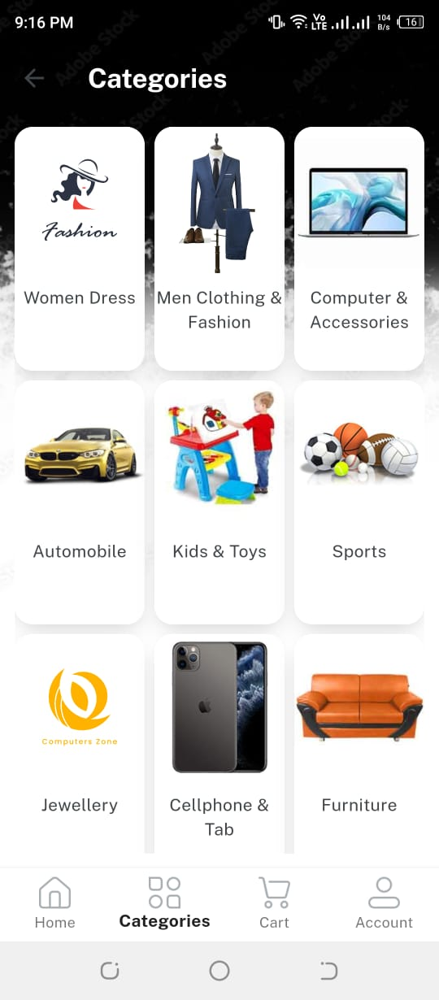
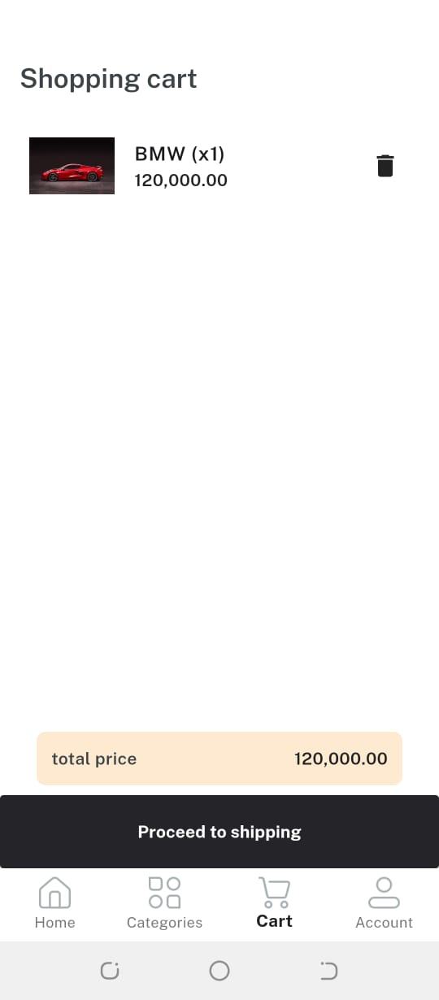

# Weather App

## Table of Contents
1. [Introduction](#introduction)
2. [Features](#features)
3. [Installation](#installation)
4. [Screenshots](#ui)
9. [Contact](#contact)

## Introduction
A sophisticated e-commerce mobile app build using
Flutter for Android, featuring a responsive UI and seamless
user experience. Leveraged Firebase for robust backend
integration, enabling real-time updates and efficient app
performance.

## Features
- Search Product
- Add to cart
- Order product
- Chat with buyer
- Multiple category
- User-friendly interface
- Responsive design for mobile and desktop

## Installation
To get started with the Weather App, follow these steps:

1. **Clone the repository:**
    ```sh
    git clone https://github.com/20-arid-535/Cartify.git
    ```

2. **Run on VS Code:**

## Screenshots
<p><br></p>


## Contact
If you have any questions, feel free to reach out:

- Noman Masood
- Email: your.email@example.com
- GitHub: 20-arid-535    
